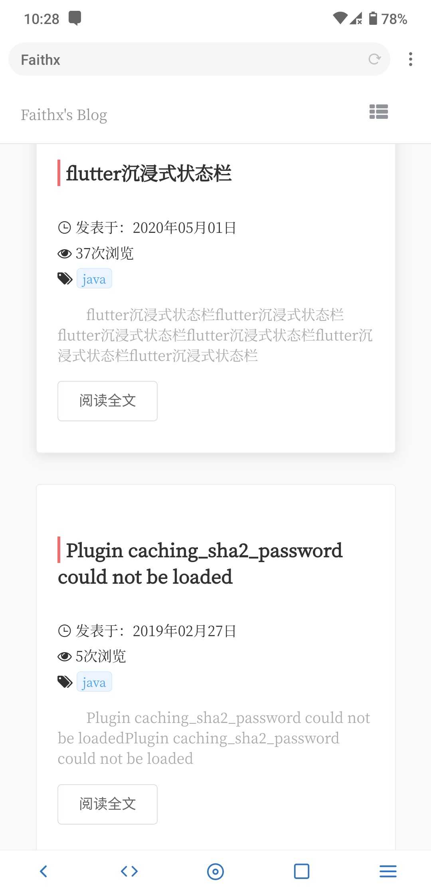

# Faith-Blog

> 一个基于SpringBoot + Vue开发的轻量级`前后端分离`博客项目，前端自适应，适配手机端。

> Demo预览地址：http://106.53.60.147/

> 默认账号：`admin`
>
> 默认密码：`111111`

## 效果图：

外链：http://106.53.60.147:9008/MyProjects/Faith-Blog/](http://106.53.60.147:9008/MyProjects/Faith-Blog/)

| CN     |  |  |  |    |  |  |
| ------ | ------------------------------ | --------------------------------- | ------------------------------- | --------------------------------- | ------------------------------- | --------------------------------- |
| EN     |  |    |  |  |                                 |                                   |
| MOBILE |    |       |     |       |     |       ||       |

## 使用技术：

- 前端：Vue/ElementUI/Axios

- 后台：MybatisPlus/shiro/jwt/Mysql/redis/SpringBoot

## 开发步骤简述：

- 前端
  1. vue整合element-ui，axios
  2. store状态管理储存jwt
  3. axios全局拦截
  4. 前端页面编写
  5. 博客编辑/发布接入mavon-editor
  6. 文章详情markdown渲染
  7. 站点国际化
  8. 友情链接功能开发
  9. 文章归档
  
- 后台

  1. SpringBoot整合MybatisPlus
  2. 利用MybatisPlus代码生成
  3. 整合shiro-redis，会话共享
  4. shiro整合jwt，身份校验
  5. 实体校验
  6. 解决跨域问题
  7. 登录接口开发
  8. 博客接口开发
  9. 博客文章置顶功能
